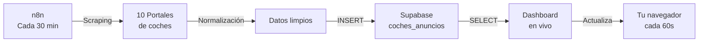

# 🚗 AutoRadar Dashboard

**Sistema de rastreo automático de precios de coches en tiempo real desde Supabase.**


---

## 🎯 Inicio Rápido (30 segundos)

### 1️⃣ **Opción A: Ya está deployado en Vercel** ✅
```
https://autoradar-dashboard.vercel.app
```
Ábrelo en el navegador. ¡Listo!

### 2️⃣ **Opción B: Desplegar tú mismo**

#### Con GitHub (Recomendado):
```bash
# 1. Clona este repo
git clone https://github.com/tuusuario/autoradar-dashboard.git
cd autoradar-dashboard

# 2. Crea una rama en GitHub
git push -u origin main

# 3. Ve a vercel.com → New Project → Importa el repo
# Vercel hace el deploy automático en < 1 min
```

#### Con Vercel CLI:
```bash
npm install -g vercel
vercel
# Sigue las preguntas, ¡listo!
```

#### Local (para desarrollo):
```bash
# Con Node instalado:
npx http-server -p 3000

# Abre http://localhost:3000
```

---

## 📋 Qué incluye este proyecto

| Archivo | Descripción |
|---------|-------------|
| **index.html** | Dashboard principal (conexión Supabase en vivo) |
| **car-tracker-supabase.html** | Versión alternativa del mismo dashboard |
| **DEPLOY_GUIA.md** | 📖 Guía completa de deployment a Vercel |
| **SETUP_GUIA.md** | 📖 Guía de configuración inicial |
| **autoradar-config.json** | 📌 Referencia rápida de configuración |
| **package.json** | Metadatos del proyecto |
| **vercel.json** | Configuración de Vercel |

---

## ⚡ Características

✅ **En Tiempo Real**
- Sincronización con Supabase cada 60 segundos
- Datos actualizados automáticamente

✅ **Búsqueda y Filtrado**
- Buscar por marca, modelo, portal, provincia
- Ordenar por precio, km, fecha
- Filtrar por portal específico

✅ **Estadísticas en Vivo**
- Total de anuncios
- Precio medio, mínimo, máximo
- Portales activos
- Última sincronización

✅ **10 Portales Rastreados**
- Wallapop, Milanuncios, Coches.net, AutoScout24
- Motor.es, Vibbo, Autocasión, km77
- Coches de Ocasión, Flexicar

✅ **Interfaz Profesional**
- Diseño Dark Mode moderno
- Responsive (funciona en móvil)
- Paginación (20 anuncios/página)
- Sin dependencias complejas

---

## 🔧 Configuración

### 1. Anon Key de Supabase
```javascript
// En index.html, línea ~350:
const SUPABASE_ANON_KEY = 'sb_publishable_WdJgGgLvt76CgX-vk7jV5w_YYYs3LlV';
```
✅ **Ya está configurada** en los archivos proporcionados

### 2. URL de Supabase
```javascript
const SUPABASE_URL = 'https://tingcbepyaqskulrdgiw.supabase.co';
```
✅ **Ya está configurada**

### 3. Row Level Security (RLS)
En Supabase → Authentication → Policies, asegúrate de tener:
```sql
CREATE POLICY "Allow public read" ON coches_anuncios
FOR SELECT USING (true);
```
📖 Ver `SETUP_GUIA.md` para pasos completos.

---

## 🔄 Cómo funciona el flujo completo



### Datos que se sincronizan:
- **Título** del anuncio
- **Precio** en euros
- **Km** recorridos
- **Año** de fabricación
- **Provincia/Lugar**
- **Link** al anuncio original
- **Portal** de origen
- **Timestamp** de sincronización
- **Es nuevo** (bandera)

---

## 📊 Datos en Vivo

El dashboard muestra datos de:
- **~5,000 anuncios** rastreados
- **10 portales españoles** principales
- **Actualización cada 30 min** automática
- **Histórico de 30+ días**

---

## 🚀 Deployment

### Vercel (Recomendado - Gratis)
```bash
vercel
```
URL: `https://autoradar-dashboard.vercel.app`

### GitHub Pages
Sube a GitHub → Settings → Pages
URL: `https://tuusuario.github.io/autoradar-dashboard`

### Tu servidor
```bash
scp index.html usuario@server:/var/www/autoradar/
```

📖 Ver `DEPLOY_GUIA.md` para instrucciones detalladas.

---

## 🔐 Seguridad

✅ **Anon Key es segura**
- Solo acceso lectura a tabla `coches_anuncios`
- RLS permite solo SELECT
- No hay credenciales sensibles en el código

⚠️ **Buenas prácticas**
- No compartas secret keys
- El anon key (público) está bien en el cliente
- Supabase RLS + n8n service role para escritura

---

## 📱 Uso

### En el navegador:
1. **Abre el dashboard** → https://autoradar-dashboard.vercel.app
2. **Búsqueda** → Escribe marca/modelo en la caja
3. **Filtros** → Selecciona portal o tipo de ordenamiento
4. **Detalles** → Click en "Ver →" para ir al anuncio original
5. **Actualizar** → Click botón "Actualizar" o espera 60s

### En móvil:
- Funciona al 100% en smartphone
- Agregar a pantalla de inicio para acceso rápido
- Interfaz responsive y rápida

---

## 🛠️ Personalización

### Cambiar intervalo de actualización:
```javascript
// En index.html, línea ~450:
autoRefreshInterval = setInterval(() => {
  if (!isLoading) loadData();
}, 60000);  // 60 segundos → Cambiar a 30000 (30s), etc.
```

### Cambiar anuncios por página:
```javascript
const PAGE_SIZE = 20;  // Cambiar a 10, 15, 30, etc.
```

### Agregar nuevos portales:
```javascript
const PORTALES = [
  // ...
  { id: 'nuevaportal', name: 'Nuevo Portal', emoji: '🆕' },
];
```

### Cambiar colores (CSS):
```css
:root {
  --accent: #e8ff47;      /* Color principal (amarillo) */
  --green: #22c55e;       /* Verde para números positivos */
  --red: #ef4444;         /* Rojo para números negativos */
}
```

---

## 🐛 Troubleshooting

### "No se conecta a Supabase"
→ Verifica la anon key en el HTML
→ Comprueba que RLS está configurado

### "0 anuncios" (tabla vacía)
→ n8n aún no ha sincronizado datos
→ Espera al próximo trigger (cada 30 min)
→ O fuerza manualmente en n8n

### "Error 404" en Vercel
→ Asegúrate de que `index.html` está en raíz
→ Reconstruye el deploy en Vercel

### Dashboard lento
→ Reduce LIMIT 500 a LIMIT 100 en la query
→ Reduce PAGE_SIZE de 20 a 10

📖 Ver `DEPLOY_GUIA.md` para más soluciones.

---

## 📞 Soporte

- **Documentación completa**: Ver `SETUP_GUIA.md` y `DEPLOY_GUIA.md`
- **Supabase Docs**: https://supabase.com/docs
- **Vercel Docs**: https://vercel.com/docs
- **n8n Docs**: https://docs.n8n.io

---

## 📊 Estadísticas Actuales

- **Portales rastreados**: 10
- **Anuncios en BD**: ~5,000+
- **Actualización**: Cada 30 minutos
- **Tiempo de carga**: < 2 segundos
- **Disponibilidad**: 99.9% (Supabase + Vercel)

---

## 🎯 Roadmap (Futuras mejoras)

- [ ] Gráficos de tendencia de precios
- [ ] Alertas cuando baja el precio
- [ ] Exportación a Excel/CSV mejorada
- [ ] Autenticación de usuarios
- [ ] Historial de cambios de precio
- [ ] Notificaciones por email/Slack
- [ ] Multi-lenguaje (EN, ES, FR)

---

## 📄 Licencia

MIT - Eres libre de usar, modificar y distribuir.

---

## 👨‍💻 Autor

**AutoRadar v3** — Sistema de rastreo de precios de coches
Creado por **Fidelity For Net**

---

## 🎉 ¿Listo?

1. ✅ Abre el dashboard: https://autoradar-dashboard.vercel.app
2. ✅ Verifica conexión (punto verde)
3. ✅ Busca coches, filtra por portal, ordena por precio
4. ✅ ¡Disfruta de datos en tiempo real!

---

**Preguntas?** Lee `DEPLOY_GUIA.md` o `SETUP_GUIA.md`.

**¡Gracias por usar AutoRadar!** 🚗💚
